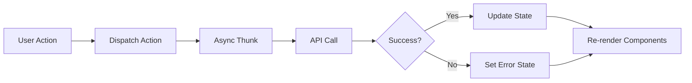
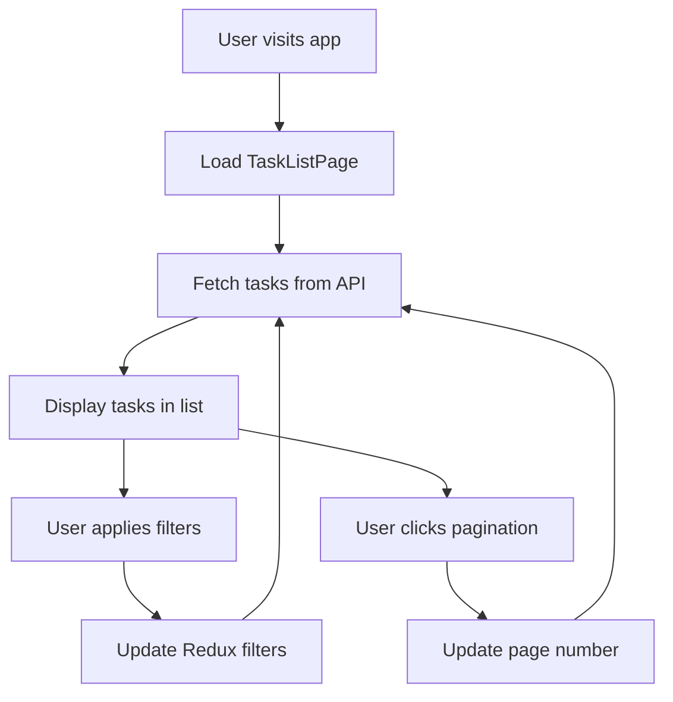
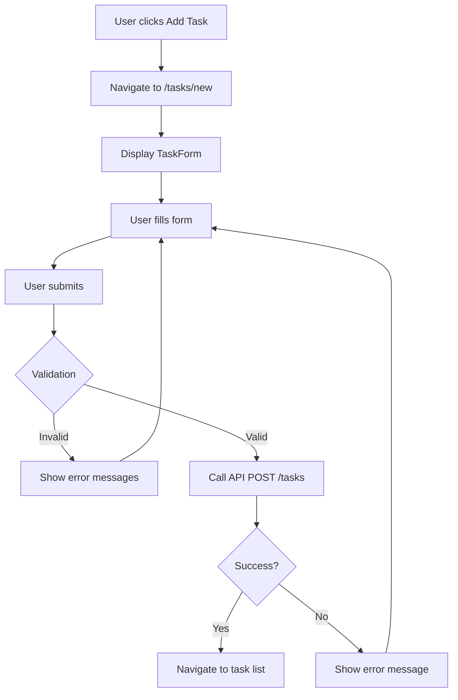
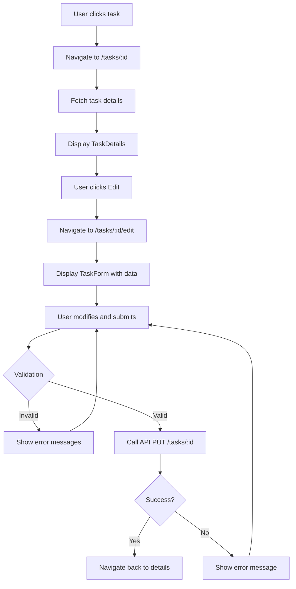
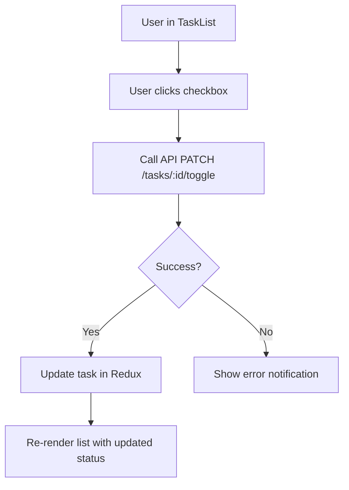

# Task Management System - Architecture Plan

## Project Overview

A full-stack task management application with:
- **Backend**: Java 21, Spring Boot 3.2+, PostgreSQL 16
- **Frontend**: React 18, TypeScript 5.x, Material-UI, Redux
- **Infrastructure**: Docker, Docker Compose
- **Build Tool**: Maven

---

## Technology Stack

### Backend
- **Java 21 (LTS)**: Latest long-term support version with modern features
- **Spring Boot 3.2+**: Enterprise-grade framework for REST APIs
- **Spring Data JPA**: Database abstraction and ORM
- **PostgreSQL 16**: Robust relational database
- **Maven**: Dependency management and build automation
- **JUnit 5 & Mockito**: Unit testing framework
- **Bean Validation (Hibernate Validator)**: Input validation

### Frontend
- **React 18**: Modern UI library with concurrent features
- **TypeScript 5.x**: Type-safe JavaScript
- **Redux Toolkit**: State management with best practices
- **React Router v6**: Client-side routing
- **Material-UI (MUI)**: Component library for consistent UI
- **Axios**: HTTP client for API calls
- **React Hook Form**: Form handling with validation
- **Jest & React Testing Library**: Unit testing
- **Playwright**: End-to-end testing

### DevOps
- **Docker**: Containerization
- **Docker Compose**: Multi-container orchestration

---

## Project Structure

```
task-management-system/
├── backend/
│   ├── src/
│   │   ├── main/
│   │   │   ├── java/com/taskmanagement/
│   │   │   │   ├── TaskManagementApplication.java
│   │   │   │   ├── config/
│   │   │   │   │   ├── CorsConfig.java
│   │   │   │   │   └── WebConfig.java
│   │   │   │   ├── controller/
│   │   │   │   │   └── TaskController.java
│   │   │   │   ├── dto/
│   │   │   │   │   ├── TaskRequestDTO.java
│   │   │   │   │   ├── TaskResponseDTO.java
│   │   │   │   │   └── ErrorResponseDTO.java
│   │   │   │   ├── entity/
│   │   │   │   │   └── Task.java
│   │   │   │   ├── exception/
│   │   │   │   │   ├── GlobalExceptionHandler.java
│   │   │   │   │   ├── TaskNotFoundException.java
│   │   │   │   │   └── ValidationException.java
│   │   │   │   ├── repository/
│   │   │   │   │   └── TaskRepository.java
│   │   │   │   └── service/
│   │   │   │       ├── TaskService.java
│   │   │   │       └── TaskServiceImpl.java
│   │   │   └── resources/
│   │   │       ├── application.yml
│   │   │       └── application-docker.yml
│   │   └── test/
│   │       └── java/com/taskmanagement/
│   │           ├── controller/
│   │           │   └── TaskControllerTest.java
│   │           ├── service/
│   │           │   └── TaskServiceTest.java
│   │           └── integration/
│   │               └── TaskIntegrationTest.java
│   ├── Dockerfile
│   ├── pom.xml
│   └── README.md
├── frontend/
│   ├── public/
│   │   └── index.html
│   ├── src/
│   │   ├── api/
│   │   │   ├── axiosConfig.ts
│   │   │   └── taskApi.ts
│   │   ├── components/
│   │   │   ├── TaskList/
│   │   │   │   ├── TaskList.tsx
│   │   │   │   ├── TaskListItem.tsx
│   │   │   │   ├── TaskFilters.tsx
│   │   │   │   └── TaskList.test.tsx
│   │   │   ├── TaskForm/
│   │   │   │   ├── TaskForm.tsx
│   │   │   │   └── TaskForm.test.tsx
│   │   │   ├── TaskDetails/
│   │   │   │   ├── TaskDetails.tsx
│   │   │   │   └── TaskDetails.test.tsx
│   │   │   └── common/
│   │   │       ├── ErrorMessage.tsx
│   │   │       ├── Loading.tsx
│   │   │       └── ConfirmDialog.tsx
│   │   ├── pages/
│   │   │   ├── TaskListPage.tsx
│   │   │   ├── AddTaskPage.tsx
│   │   │   └── EditTaskPage.tsx
│   │   ├── store/
│   │   │   ├── store.ts
│   │   │   ├── hooks.ts
│   │   │   └── slices/
│   │   │       └── taskSlice.ts
│   │   ├── types/
│   │   │   └── task.types.ts
│   │   ├── utils/
│   │   │   ├── dateUtils.ts
│   │   │   └── validators.ts
│   │   ├── App.tsx
│   │   ├── App.test.tsx
│   │   └── index.tsx
│   ├── e2e/
│   │   ├── task-management.spec.ts
│   │   └── playwright.config.ts
│   ├── Dockerfile
│   ├── package.json
│   ├── tsconfig.json
│   └── README.md
├── docker-compose.yml
├── .gitignore
└── README.md
```

---

## Architecture Decisions

### 1. **Layered Architecture (Backend)**

**Decision**: Use a classic 3-tier architecture with Controller → Service → Repository layers.

**Rationale**:
- **Separation of Concerns**: Each layer has a distinct responsibility
- **Testability**: Easy to mock dependencies and test each layer independently
- **Maintainability**: Changes in one layer don't cascade to others
- **Industry Standard**: Well-understood pattern for Spring Boot applications

**Layers**:
- **Controller Layer**: Handles HTTP requests/responses, input validation
- **Service Layer**: Contains business logic, transaction management
- **Repository Layer**: Data access abstraction using Spring Data JPA

### 2. **DTO Pattern**

**Decision**: Use separate DTOs for requests and responses instead of exposing entities directly.

**Rationale**:
- **Security**: Prevents over-posting and exposure of internal fields
- **Flexibility**: API contract independent of database schema
- **Validation**: Clean separation of validation rules
- **Versioning**: Easier to version APIs without changing entities

### 3. **Redux Toolkit for State Management**

**Decision**: Use Redux Toolkit with async thunks for API calls.

**Rationale**:
- **Predictable State**: Single source of truth for application state
- **DevTools**: Excellent debugging capabilities
- **Middleware**: Built-in support for async operations
- **Best Practices**: Redux Toolkit enforces modern Redux patterns
- **Scalability**: Easy to add new features and slices

### 4. **Material-UI Component Library**

**Decision**: Use MUI for UI components instead of building from scratch.

**Rationale**:
- **Consistency**: Pre-built components with consistent design
- **Accessibility**: WCAG compliant components out of the box
- **Productivity**: Faster development with ready-to-use components
- **Theming**: Built-in theming system for customization
- **Documentation**: Excellent documentation and community support

### 5. **Docker Containerization**

**Decision**: Containerize all services (backend, frontend, database).

**Rationale**:
- **Consistency**: Same environment across development and production
- **Isolation**: Each service runs in its own container
- **Portability**: Easy to deploy anywhere Docker runs
- **Orchestration**: Docker Compose simplifies multi-container setup
- **Development**: Quick setup for new developers

### 6. **RESTful API Design**

**Decision**: Follow REST principles with proper HTTP methods and status codes.

**Endpoints**:
```
GET    /api/tasks              - Get all tasks (with pagination, sorting, filtering)
GET    /api/tasks/{id}         - Get task by ID
POST   /api/tasks              - Create new task
PUT    /api/tasks/{id}         - Update task
PATCH  /api/tasks/{id}/toggle  - Toggle completion status
DELETE /api/tasks/{id}         - Delete task
```

**Rationale**:
- **Standard**: Industry-standard approach for web APIs
- **Stateless**: Each request contains all necessary information
- **Cacheable**: GET requests can be cached
- **Clear Semantics**: HTTP methods indicate operation type

### 7. **Pagination, Sorting, and Filtering**

**Decision**: Implement server-side pagination with query parameters.

**Query Parameters**:
```
?page=0&size=10&sort=dueDate,asc&completed=false&search=keyword
```

**Rationale**:
- **Performance**: Reduces data transfer and memory usage
- **Scalability**: Handles large datasets efficiently
- **User Experience**: Faster page loads
- **Flexibility**: Users can customize view

### 8. **Validation Strategy**

**Backend Validation**:
- Bean Validation annotations (`@NotNull`, `@NotBlank`, `@Size`, `@Future`)
- Custom validators for business rules
- Global exception handler for consistent error responses

**Frontend Validation**:
- React Hook Form with validation rules
- Real-time validation feedback
- User-friendly error messages

**Rationale**:
- **Defense in Depth**: Validate on both client and server
- **User Experience**: Immediate feedback on frontend
- **Security**: Server-side validation prevents malicious requests

### 9. **Error Handling**

**Decision**: Centralized error handling with consistent error response format.

**Error Response Format**:
```json
{
  "timestamp": "2026-02-19T09:20:00Z",
  "status": 400,
  "error": "Bad Request",
  "message": "Title is required",
  "path": "/api/tasks"
}
```

**Rationale**:
- **Consistency**: Same error format across all endpoints
- **Debugging**: Timestamp and path help troubleshooting
- **User-Friendly**: Clear messages for frontend display
- **Standards**: Follows HTTP status code conventions

### 10. **Testing Strategy**

**Backend Testing**:
- **Unit Tests**: Service layer with mocked repositories
- **Controller Tests**: Using MockMvc for endpoint testing
- **Integration Tests**: Full stack with test database

**Frontend Testing**:
- **Unit Tests**: Components and Redux slices with Jest
- **E2E Tests**: Critical user flows with Playwright

**Rationale**:
- **Quality**: Catch bugs early in development
- **Confidence**: Safe refactoring with test coverage
- **Documentation**: Tests serve as usage examples
- **Regression Prevention**: Automated tests prevent breaking changes

---

## Data Model

### Task Entity

```java
@Entity
@Table(name = "tasks")
public class Task {
    @Id
    @GeneratedValue(strategy = GenerationType.IDENTITY)
    private Long id;
    
    @NotBlank(message = "Title is required")
    @Size(max = 200, message = "Title must not exceed 200 characters")
    @Column(nullable = false, length = 200)
    private String title;
    
    @Size(max = 1000, message = "Description must not exceed 1000 characters")
    @Column(length = 1000)
    private String description;
    
    @Column(nullable = false)
    private Boolean isCompleted = false;
    
    @Future(message = "Due date must be in the future")
    @Column(name = "due_date")
    private LocalDate dueDate;
    
    @Column(name = "created_at", nullable = false, updatable = false)
    private LocalDateTime createdAt;
    
    @Column(name = "updated_at")
    private LocalDateTime updatedAt;
    
    @PrePersist
    protected void onCreate() {
        createdAt = LocalDateTime.now();
        updatedAt = LocalDateTime.now();
    }
    
    @PreUpdate
    protected void onUpdate() {
        updatedAt = LocalDateTime.now();
    }
}
```

**Design Decisions**:
- **Auto-increment ID**: Simple and efficient for single database
- **Timestamps**: Track creation and modification times
- **Validation Annotations**: Enforce data integrity at entity level
- **Boolean for completion**: Simple flag, could be extended to status enum
- **LocalDate for dueDate**: Date without time complexity

---

## API Specifications

### 1. Get All Tasks (with pagination, sorting, filtering)

**Request**:
```
GET /api/tasks?page=0&size=10&sort=dueDate,asc&completed=false&search=keyword
```

**Response** (200 OK):
```json
{
  "content": [
    {
      "id": 1,
      "title": "Complete project documentation",
      "description": "Write comprehensive docs",
      "isCompleted": false,
      "dueDate": "2026-02-25",
      "createdAt": "2026-02-19T09:00:00Z",
      "updatedAt": "2026-02-19T09:00:00Z"
    }
  ],
  "pageable": {
    "pageNumber": 0,
    "pageSize": 10,
    "sort": {
      "sorted": true,
      "unsorted": false
    }
  },
  "totalElements": 1,
  "totalPages": 1,
  "last": true,
  "first": true
}
```

### 2. Get Task by ID

**Request**:
```
GET /api/tasks/1
```

**Response** (200 OK):
```json
{
  "id": 1,
  "title": "Complete project documentation",
  "description": "Write comprehensive docs",
  "isCompleted": false,
  "dueDate": "2026-02-25",
  "createdAt": "2026-02-19T09:00:00Z",
  "updatedAt": "2026-02-19T09:00:00Z"
}
```

**Error Response** (404 Not Found):
```json
{
  "timestamp": "2026-02-19T09:20:00Z",
  "status": 404,
  "error": "Not Found",
  "message": "Task not found with id: 1",
  "path": "/api/tasks/1"
}
```

### 3. Create Task

**Request**:
```
POST /api/tasks
Content-Type: application/json

{
  "title": "New task",
  "description": "Task description",
  "dueDate": "2026-02-25"
}
```

**Response** (201 Created):
```json
{
  "id": 2,
  "title": "New task",
  "description": "Task description",
  "isCompleted": false,
  "dueDate": "2026-02-25",
  "createdAt": "2026-02-19T09:30:00Z",
  "updatedAt": "2026-02-19T09:30:00Z"
}
```

**Error Response** (400 Bad Request):
```json
{
  "timestamp": "2026-02-19T09:20:00Z",
  "status": 400,
  "error": "Bad Request",
  "message": "Title is required",
  "path": "/api/tasks"
}
```

### 4. Update Task

**Request**:
```
PUT /api/tasks/1
Content-Type: application/json

{
  "title": "Updated task",
  "description": "Updated description",
  "isCompleted": true,
  "dueDate": "2026-02-26"
}
```

**Response** (200 OK):
```json
{
  "id": 1,
  "title": "Updated task",
  "description": "Updated description",
  "isCompleted": true,
  "dueDate": "2026-02-26",
  "createdAt": "2026-02-19T09:00:00Z",
  "updatedAt": "2026-02-19T09:35:00Z"
}
```

### 5. Toggle Task Completion

**Request**:
```
PATCH /api/tasks/1/toggle
```

**Response** (200 OK):
```json
{
  "id": 1,
  "title": "Complete project documentation",
  "description": "Write comprehensive docs",
  "isCompleted": true,
  "dueDate": "2026-02-25",
  "createdAt": "2026-02-19T09:00:00Z",
  "updatedAt": "2026-02-19T09:40:00Z"
}
```

### 6. Delete Task

**Request**:
```
DELETE /api/tasks/1
```

**Response** (204 No Content)

---

## Frontend Architecture

### Component Hierarchy

```
App
├── Router
    ├── TaskListPage
    │   ├── TaskFilters (sorting, filtering controls)
    │   ├── TaskList
    │   │   └── TaskListItem (multiple, with toggle checkbox)
    │   └── Pagination
    ├── AddTaskPage
    │   └── TaskForm (create mode)
    └── EditTaskPage
        ├── TaskDetails (read-only view)
        └── TaskForm (edit mode)
```

### Redux Store Structure

```typescript
{
  tasks: {
    items: Task[],
    currentTask: Task | null,
    loading: boolean,
    error: string | null,
    pagination: {
      page: number,
      size: number,
      totalElements: number,
      totalPages: number
    },
    filters: {
      completed: boolean | null,
      search: string,
      sortBy: 'title' | 'dueDate' | 'createdAt',
      sortOrder: 'asc' | 'desc'
    }
  }
}
```

### Routing Structure

```
/                    → TaskListPage (default)
/tasks               → TaskListPage
/tasks/new           → AddTaskPage
/tasks/:id           → TaskDetails (read-only)
/tasks/:id/edit      → EditTaskPage
```

---

## State Management Flow



### Key Redux Slices

**taskSlice.ts**:
- **State**: tasks, loading, error, pagination, filters
- **Reducers**: setFilters, clearError, resetState
- **Async Thunks**: 
  - `fetchTasks` - Get paginated tasks
  - `fetchTaskById` - Get single task
  - `createTask` - Create new task
  - `updateTask` - Update existing task
  - `toggleTaskCompletion` - Toggle completion status
  - `deleteTask` - Delete task

---

## User Flows

### Flow 1: View and Filter Tasks



### Flow 2: Create New Task



### Flow 3: Edit Task



### Flow 4: Toggle Task Completion



---

## Docker Configuration

### docker-compose.yml Structure

```yaml
services:
  postgres:
    - PostgreSQL 16 database
    - Persistent volume for data
    - Environment variables for credentials
    
  backend:
    - Spring Boot application
    - Depends on postgres
    - Exposes port 8080
    - Health check endpoint
    
  frontend:
    - React application (production build)
    - Nginx server
    - Depends on backend
    - Exposes port 3000
```

### Container Communication

```
Frontend (port 3000) → Backend (port 8080) → PostgreSQL (port 5432)
```

---

## Development Workflow

### Backend Development

1. **Setup**: Run PostgreSQL locally or via Docker
2. **Development**: Use Spring Boot DevTools for hot reload
3. **Testing**: Run tests with `mvn test`
4. **Build**: Package with `mvn clean package`
5. **Run**: Execute JAR or use `mvn spring-boot:run`

### Frontend Development

1. **Setup**: Install dependencies with `npm install`
2. **Development**: Run dev server with `npm start`
3. **Testing**: Run tests with `npm test`
4. **E2E Testing**: Run Playwright with `npm run test:e2e`
5. **Build**: Create production build with `npm run build`

### Full Stack with Docker

1. **Build**: `docker-compose build`
2. **Run**: `docker-compose up`
3. **Stop**: `docker-compose down`
4. **Clean**: `docker-compose down -v` (removes volumes)

---

## Testing Strategy

### Backend Tests

**Unit Tests** (Service Layer):
```java
@ExtendWith(MockitoExtension.class)
class TaskServiceTest {
    @Mock
    private TaskRepository taskRepository;
    
    @InjectMocks
    private TaskServiceImpl taskService;
    
    @Test
    void shouldCreateTask() {
        // Test business logic in isolation
    }
}
```

**Controller Tests**:
```java
@WebMvcTest(TaskController.class)
class TaskControllerTest {
    @Autowired
    private MockMvc mockMvc;
    
    @MockBean
    private TaskService taskService;
    
    @Test
    void shouldReturnTasks() throws Exception {
        // Test HTTP endpoints
    }
}
```

**Integration Tests**:
```java
@SpringBootTest
@AutoConfigureTestDatabase
class TaskIntegrationTest {
    @Autowired
    private TestRestTemplate restTemplate;
    
    @Test
    void shouldCreateAndRetrieveTask() {
        // Test full stack with real database
    }
}
```

### Frontend Tests

**Component Tests**:
```typescript
describe('TaskList', () => {
  it('should render tasks', () => {
    // Test component rendering and behavior
  });
});
```

**Redux Tests**:
```typescript
describe('taskSlice', () => {
  it('should handle fetchTasks', () => {
    // Test state management logic
  });
});
```

**E2E Tests** (Playwright):
```typescript
test('should create and complete task', async ({ page }) => {
  // Test complete user flow
  await page.goto('/');
  await page.click('text=Add Task');
  await page.fill('[name="title"]', 'Test Task');
  await page.click('button[type="submit"]');
  await expect(page.locator('text=Test Task')).toBeVisible();
});
```

---

## Security Considerations

### Backend Security

1. **CORS Configuration**: Allow frontend origin only
2. **Input Validation**: Validate all inputs with Bean Validation
3. **SQL Injection Prevention**: Use JPA parameterized queries
4. **Error Messages**: Don't expose sensitive information
5. **Rate Limiting**: Consider adding for production

### Frontend Security

1. **XSS Prevention**: React escapes by default
2. **HTTPS**: Use in production
3. **Environment Variables**: Store API URL in env files
4. **Input Sanitization**: Validate user inputs

---

## Performance Optimizations

### Backend

1. **Pagination**: Limit data transfer
2. **Database Indexing**: Index frequently queried columns (dueDate, isCompleted)
3. **Connection Pooling**: Configure HikariCP properly
4. **Caching**: Consider Redis for frequently accessed data (future enhancement)

### Frontend

1. **Code Splitting**: Lazy load routes
2. **Memoization**: Use React.memo for expensive components
3. **Debouncing**: Debounce search input
4. **Virtual Scrolling**: For large lists (future enhancement)
5. **Production Build**: Minification and optimization

---

## Future Enhancements

1. **Authentication & Authorization**: Add user login with JWT
2. **Task Categories/Tags**: Organize tasks by category
3. **Task Priority**: Add priority levels (high, medium, low)
4. **Recurring Tasks**: Support for repeating tasks
5. **Notifications**: Email/push notifications for due dates
6. **File Attachments**: Attach files to tasks
7. **Comments**: Add comments to tasks
8. **Search**: Full-text search with Elasticsearch
9. **Analytics**: Dashboard with task statistics
10. **Mobile App**: React Native mobile application

---

## Success Criteria

### Functional Requirements
- ✅ All CRUD operations working
- ✅ Pagination, sorting, and filtering implemented
- ✅ Toggle completion from list view
- ✅ Form validation with user-friendly messages
- ✅ Client-side routing functional
- ✅ Redux state management working correctly

### Technical Requirements
- ✅ Clean, readable code with proper structure
- ✅ Comprehensive error handling
- ✅ Unit tests with good coverage
- ✅ E2E tests for critical flows
- ✅ Docker setup working
- ✅ Clear setup instructions in README files
- ✅ Architecture documentation complete

### Quality Attributes
- ✅ Responsive UI that works on different screen sizes
- ✅ Fast page loads and smooth interactions
- ✅ Consistent error messages
- ✅ Accessible UI components (MUI provides this)
- ✅ Maintainable codebase with clear separation of concerns

---

## Estimated Implementation Order

1. **Phase 1: Project Setup & Infrastructure**
   - Create directory structure
   - Set up Docker configuration
   - Initialize backend Spring Boot project
   - Initialize frontend React project

2. **Phase 2: Backend Core**
   - Implement Task entity with validation
   - Create repository layer
   - Implement service layer with business logic
   - Create REST controllers
   - Add exception handling

3. **Phase 3: Backend Testing**
   - Write unit tests for service layer
   - Write controller tests
   - Add integration tests

4. **Phase 4: Frontend Core**
   - Set up Redux store and slices
   - Implement API service layer
   - Create TaskList component with pagination
   - Create TaskForm component
   - Create TaskDetails component

5. **Phase 5: Frontend Features**
   - Implement routing
   - Add sorting and filtering
   - Add form validation
   - Implement toggle completion

6. **Phase 6: Frontend Testing**
   - Write component unit tests
   - Write Redux tests
   - Implement Playwright E2E tests

7. **Phase 7: Documentation & Polish**
   - Write comprehensive README files
   - Document setup instructions
   - Add code comments
   - Final testing and bug fixes

---

## Key Files to Create

### Backend
- `pom.xml` - Maven dependencies
- `application.yml` - Spring Boot configuration
- `Task.java` - Entity with validation
- `TaskRepository.java` - JPA repository
- `TaskService.java` & `TaskServiceImpl.java` - Business logic
- `TaskController.java` - REST endpoints
- `GlobalExceptionHandler.java` - Error handling
- `TaskRequestDTO.java` & `TaskResponseDTO.java` - Data transfer objects
- Test files for each layer

### Frontend
- `package.json` - NPM dependencies
- `store.ts` - Redux store configuration
- `taskSlice.ts` - Redux slice for tasks
- `taskApi.ts` - API service layer
- `TaskList.tsx` - Task list component
- `TaskForm.tsx` - Form component
- `TaskDetails.tsx` - Details component
- `App.tsx` - Main app with routing
- Test files for components and Redux
- `task-management.spec.ts` - E2E tests

### Docker
- `docker-compose.yml` - Multi-container setup
- `backend/Dockerfile` - Backend container
- `frontend/Dockerfile` - Frontend container

### Documentation
- `README.md` (root) - Project overview and quick start
- `backend/README.md` - Backend setup and API docs
- `frontend/README.md` - Frontend setup and development guide

---

This architecture provides a solid foundation for a production-ready task management application with modern best practices, comprehensive testing, and clear documentation.
